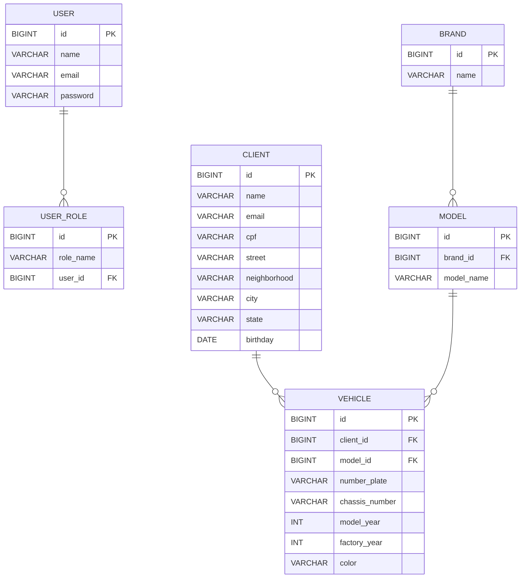

# Cadcar


🚗 Um sistema simples de registro de carro.

## 🗄️ Arquivos DDLs para criação do banco de dados

Os arquivos DDL podem ser encontrado aqui: https://github.com/RicardoAndradeM/cadcar/tree/main/src/main/resources/db/migration

Vale lembrar que este projeto usa a ferramenta de migração de bancos de dados Flyway. Ela executará as migrações SQL automaticamente quando a aplicação for executada, não sendo necessário, portanto, executar as DDLs manualmente no banco de dados.


## 💻 Executando a aplicação
### Pré-requisitos
- **Java 17** instalado.
- **Gradle** instalado (ou usar o wrapper `./gradlew` que vem com o projeto).
- Banco de dados configurado se for rodar o perfil de produção (MySQL).

Há dois perfis para de executar a aplicação:
- dev: usando banco de dados em memória H2.
- prd: usando banco de dados MySQL.

### Executando com perfil dev

1. Defina ou Exporte as variáveis de ambiente:
```bash
export PROFILE=dev
export JWTSECRET=<seu_jwt_secret_dev>
```

#### Explicação:
`<seu_jwt_secret_dev>`: Chave Base64 (Pode ser gerada com `openssl rand -base64 64`) 

2. Rode a aplicação via Gradle:
```bash
./gradlew bootRun
```

### Executando com perfil prd

1. Defina ou Exporte as variáveis de ambiente:
```bash
export PROFILE=prd
export DBDATABASE=<nome_do_banco>
export DBHOST=<host_do_banco>
export DBPORT=<porta>
export DBUSER=<usuario>
export DBPASSWORD=<senha>
export JWTSECRET=<seu_jwt_secret>
```

#### Explicação:
`<seu_jwt_secret_dev>`: Chave Base64 (Pode ser gerada com `openssl rand -base64 64`) 

2. Rode a aplicação via Gradle:
```bash
./gradlew bootRun
```

## 📜 Swagger

Quando a aplicação está em execução, a documentação Swagger fica disponível em: http://localhost:8080/swagger-ui/index.html

## 📈 Modelo Entidade Relacional




## 🚀 Stack utilizada

**Java:** 17

**Gradle:** 8.13

**SpringBoot:** 3.5.5

## 👨‍💻 Autor

- [@RicardoAndradeM](https://github.com/RicardoAndradeM)

